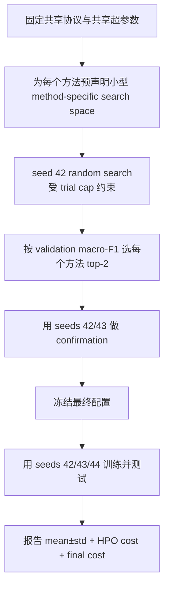

# 有限预算下仇恨言论检测微调比较的超参数决策报告

## 执行摘要

对你们这个项目而言，**不建议把所有方法强行绑定为“完全相同的一套超参数”**。更好的主实验设计不是“完全固定统一超参数”，也不是“每个方法无限自由地各调各的”，而是采用**混合方案**：**固定共享协议与大部分共享训练条件，只对真正方法特有、且最影响结果的少数超参数做小规模、预声明的搜索**。原因很直接：`TF-IDF+LR`、`Bi-LSTM from scratch`、`frozen backbone`、`partial FT`、`full FT`、`LoRA`、`LP-FT` 与 `efficient head FT` 属于不同模型族，它们的“旋钮”本来就不同；而公平性真正取决于**相同的 dataset/split、相同的验证准则、相同的 early stopping 规则、预声明的搜索空间与 trial cap、以及严格禁止 test-set 调参**，而不取决于把不兼容的方法硬塞进同一套超参数模板。citeturn18view2turn18view1turn8view1turn8view3turn2search0turn8view0turn8view6

在你们设定的 urlColab FAQturn2search3 场景下，这一点更重要。官方 FAQ 明确写到：Colab 资源**不保证、也不无限**，usage limits、可用 GPU 类型、最长运行时长都会变化；付费计划也仍然受 availability 影响。也就是说，如果把公平性定义成“完全相同 GPU 小时”，在异构 Colab 环境里往往并不真正可比。因此，主实验最稳妥的做法是：**以 trial cap + 统一验证协议作为公平性的主约束，以 wall-clock、peak memory、trainable parameters 作为结果变量进行报告**。citeturn9view1turn9view2turn9view0

我给出的最终建议是：**采用方案 C（混合方案，推荐）**。具体做法是：固定共享设置（数据划分、文本构造、最大长度、optimizer 家族、early stopping、selection metric、seed policy、日志格式），然后只对各方法的**少数 load-bearing hyperparameters**做非常小的 random search；例如 full FT 主要调 `lr`，partial FT 主要调 `top_k + lr`，LoRA 主要调 `r + lr + target_modules`，LP-FT 与 efficient head FT 则采用阶段化的小空间搜索。这个方案在公平性、可复现性与自费 Colab 成本之间的折中最好。citeturn18view2turn18view1turn8view1turn8view2turn8view3turn13view2turn13view3turn13view0

## 研究问题与关键假设

本报告回答的核心问题是：**在资源受限、且硬件不完全稳定的 Colab 条件下，主实验应采用哪种超参数策略——方法特定调参、统一固定超参数，还是混合方案——才能在公平性、可复现性与成本效益之间达到最优平衡？** 这个问题并不是纯粹的工程偏好问题，而是典型的 empirical NLP 研究设计问题，因为模型选择方式本身会引入偏差与额外计算成本。citeturn18view1turn8view1turn8view3

本报告基于以下关键假设；若与你们最终实现不同，建议在论文中显式改写这些假设而不是默认沿用：

| 假设项 | 当前设定 | 状态 |
| --- | --- | --- |
| 数据集 | HateXplain 官方数据卡对应的英语 3 类任务（hate / offensive / normal） | 已指定 |
| 标签策略 | 采用官方三分类语义；若你们自己做 strict majority vote 与去除 no-majority，需在论文中补充写清 | 部分已指定 |
| 主 backbone | `distilbert-base-uncased` | 已指定 |
| 资源环境 | Colab，自费/有限预算；GPU 类型可能变化 | 已指定 |
| 主评价指标 | validation macro-F1 作为 model-selection metric | 已指定 |
| 最终报告 | 多 seed 的 mean ± std，而不是 single best run | 已指定 |
| mixed precision / gradient checkpointing | **未指定**；建议主实验统一固定，不要按方法区别开启 | 未指定 |
| class weighting / weighted CE | **未指定**；建议主实验统一策略 | 未指定 |
| data fractions | 仅作 bonus，而非主实验全方法全组合 | 已指定/建议保持 |

HateXplain 官方数据卡说明，它是英语社交媒体仇恨言论基准数据集，基础任务是三分类；每个帖子由 3 名标注者标注，并包含标签、target community 和 rationales。DistilBERT 官方文档则说明它是通过知识蒸馏得到的更小、更快、训练成本更低的 BERT 变体，因此非常适合你们这种“性能—效率”主题下的受限算力比较。citeturn16view0turn16view1

## 证据综述与总体判断

### 证据表

| 论文 / 文档 | 对“不同方法可否用不同超参数”的立场 | 主要证据 | 对你们项目的含义 |
| --- | --- | --- | --- |
| Bergstra & Bengio 2012, *Random Search for Hyper-Parameter Optimization*（JMLR）citeturn18view0turn18view2 | **支持（间接）** | 把 HPO 写成在超参数空间 `Λ` 上的搜索问题；明确指出不同数据集、任务和学习算法家族会产生不同的 `Λ` 与响应函数 `Ψ`；random search 在同预算下通常优于 grid search。 | 不同方法拥有不同 search space 是正常前提；公平性不应来自“同一套超参数名”，而来自统一搜索协议。 |
| Cawley & Talbot 2010, *On Over-fitting in Model Selection...*（JMLR）citeturn18view1 | **支持（附条件）** | model selection 本身会 overfit；这种 selection bias 的量级可与算法差异相当。 | 可以调各自超参数，但**必须**用 validation、不能用 test，且要限制/报告搜索。 |
| Dodge et al. 2019, *Show Your Work*（EMNLP）citeturn8view1 | **支持（附条件）** | 仅报告 test score 不够；应把 validation performance 与 computation budget 一起报告。 | 不同方法可用不同超参数，但必须报告 search bounds、trial 数、预算和 validation 结果。 |
| Reimers & Gurevych 2017, *Reporting Score Distributions Makes a Difference*（EMNLP）citeturn8view2 | **中立但强约束** | 单次分数不足以比较非确定性模型；不同 seed 可带来统计显著差异。 | 不要把 HPO 预算全花在扩大 search space；必须留下预算做 multi-seed confirmation。 |
| ACL Reproducibility Checklist 2021citeturn8view3 | **支持（间接）** | 要求报告每个 hyperparameter 的 bounds、最佳配置、训练/评估 runs 数、选择方法与 summary statistics。 | 这套 checklist 默认接受“方法有各自 hyperparameter bounds”，关键是写清。 |
| LoRA paper（Hu et al.）+ urlPEFT LoRA 文档turn8view4 citeturn2search0turn13view2turn13view3turn13view0 | **直接支持** | LoRA 本身就引入 `r`、`lora_alpha`、`lora_dropout`、`target_modules`、`modules_to_save` 等 full FT 没有的旋钮。 | 把 LoRA 强行设成和 full FT 一样的“统一超参数”在概念上不成立。 |
| Kumar et al. 2022, *Fine-Tuning can Distort Pretrained Features...*（ICLR）citeturn8view0 | **直接支持** | LP-FT 本身是两阶段方法：先 linear probing，再 full FT。 | 两阶段方法天然需要阶段性超参数，不可能只用 single-stage 统一设置。 |
| Yang et al. 2022, *Parameter-Efficient Tuning Makes a Good Classification Head*（EMNLP）citeturn8view6 | **直接支持** | Efficient head FT 的核心就是 stage 1 用 parameter-efficient tuning 学更好的 head，再做 stage 2。 | EH-FT 也天然需要阶段性、方法特定的超参数。 |
| Razuvayevskaya et al. 2024, *PEFT vs Full FT: A Case Study on Multilingual News Classification*citeturn15view0 | **支持（相似研究）** | 直接比较 LoRA/adapters 与 full FT 的分类性能和计算成本。 | 说明“性能 vs 效率”的比较型文本分类研究本来就会把不同适配方法放在同一实验里比较。 |
| urlColab FAQturn2search3 citeturn9view1turn9view2turn9view3 | **中立但强约束** | 资源不保证、usage limits 波动、GPU 类型会变、最长运行时长受 availability 影响。 | 在 Colab 中，公平预算更适合用 `trial cap + 统一协议`，而不是只盯“相同 GPU 小时”。 |

### 总体判断

从现有原始论文与官方文档看，**没有强证据支持把 TF-IDF、Bi-LSTM、full FT、LoRA、LP-FT、EH-FT 这类异构方法强行绑定为“完全相同的一套超参数”**。相反，现有证据更一致地支持这样一种设计：**允许方法拥有各自的 method-specific search space，但必须使用统一的 validation protocol、透明的 search bounds、可比较的预算约束、严格禁止 test leakage，并报告 seed distribution 与计算成本。** citeturn18view2turn18view1turn8view1turn8view2turn8view3turn13view2turn8view0turn8view6

这意味着，“Different methods CAN use different hyperparameters” 作为一句**原则性总结**是有文献支撑的，但支撑它的不是某个单独句子的逐字引文，而是多篇关于 HPO、model selection、reproducibility 与具体适配方法的论文共同得出的研究设计结论。更重要的是，这个原则对你们项目**是 good idea**，但前提不是“无限自由地各调各的”，而是要进入一个**受控的混合方案**。citeturn18view2turn18view1turn8view1turn8view3

## 比较维度与权衡结论

### 公平性

如果把所有方法用完全一样的超参数，表面上看很“公平”，但实际上会把某些方法放在明显劣势上。例如 frozen backbone 通常可以使用远高于 full FT 的 head learning rate；LoRA 还需要 `r/alpha/dropout/target_modules`；LP-FT 与 EH-FT 又是两阶段训练。对这些方法强行统一超参数，更可能得到的是**统一的次优配置**，而不是公平比较。真正的公平性来自：同一数据、同一 split、同一验证指标、同一 early stopping 规则、同一 test-set 隔离规则、以及预声明的预算。citeturn13view2turn13view3turn13view0turn8view0turn8view6turn18view1turn8view3

### 可复现性

可复现性最怕的不是“方法有不同超参数”，而是**search space 不透明**、**手工临场改设置**、**不报告 runs/seed/budget**。ACL checklist 和 Dodge 都把“bounds、best configs、trial 数、selection criterion、summary statistics”列为核心可复现信息；这说明研究界接受 method-specific hyperparameters，但要求把它们报告到足以复现的程度。citeturn8view1turn8view3

### 统计稳定性

Reimers & Gurevych 证明，单次分数不足以比较非确定性模型；seed 改变本身就可能带来显著差异。对于你们这种比较型论文，若把预算全部拿去扩大搜索空间，而不做 multi-seed confirmation，最后很容易把 seed 噪声误写成“某方法更优”。因此在有限预算下，**缩小 search space、保留多 seed 验证预算**通常比盲目扩大 search 更科学。citeturn8view2

### 计算成本

Dodge 等强调，模型比较应把计算预算与验证性能一起汇报。你们的研究题目本身就是“Performance vs Efficiency”，所以要把**HPO cost**和**final-model cost**分开：前者是为了找到好超参数花掉的 trial/time，后者是固定最终配置后训练一个模型的真实成本。对于 Colab，自费情况下最容易失控的其实是 HPO cost；因此从成本效益看，完全方法特定、宽范围搜索并不是最佳选择。citeturn8view1turn9view2

### 实现复杂度与可解释性

统一固定超参数最容易实现，也最好讲故事，但科学性最弱。完全方法特定调参科学性较强，却会提高实现复杂度、脚本分叉和记录负担。混合方案在实现复杂度与解释性上最平衡：你们可以在论文里清楚说“共享设置全部固定；只有真正方法特有且最关键的 1–3 个超参数被允许搜索”。这种设计比“完全自由”更容易让评审相信比较是受控的。citeturn8view3turn8view1

结论上，若只在三个维度中选一个最优点，**Colab/有限预算下的最优不是 A 的“完全方法特定大搜索”，也不是 B 的“完全统一固定”，而是 C 的“混合方案”**。citeturn18view2turn18view1turn8view1turn8view2turn8view3

## 三种可选策略对比

下表中的 trial cap 与 GPU 小时为**作者基于你们项目条件的实施估计**，前提是假设：HateXplain、DistilBERT-base、`max_length=128`、单卡 Colab GPU、统一训练脚手架、无分布式训练。由于 urlColab FAQturn2search3 明确说明硬件可用性与运行时会波动，这些 GPUh 只能作为预算规划，不应被当作精确可比的“物理常数”。citeturn9view1turn9view2

| 方案 | 核心步骤 | 建议 trial cap | GPUh 估计 | 优点 | 缺点 | 何时采用 |
| --- | --- | ---: | ---: | --- | --- | --- |
| A 方法特定调参 | 每个方法单独定义 search space；统一 validation/early stopping/test rule；random search | TF-IDF 16；Bi-LSTM 10；frozen/full/partial/LoRA 各 8；LP-FT/EH-FT 各 6 | 总计约 8–14 GPUh + CPU 若干 | 科学性最强；最接近“各方法都被合理调优” | 对 Colab 预算压力最大；复杂方法可能还会被 under-tuned | 预算中等以上、时间充裕、想把方法比较做得更“研究级” |
| B 统一固定超参数 | 除方法结构差异外，训练超参数尽量固定；几乎不做 HPO | 0–1/方法 | 总计约 2–4 GPUh | 实现最简单；最省钱；结果最易复现 | 对异构方法不公平；容易把某些方法人为压低；不建议作为主实验 | 只适合 pilot、教学演示或附录 sanity check |
| C 混合方案（推荐） | 固定共享设置；仅对每个方法的少数 load-bearing knobs 做小范围搜索；高成本方法再缩窄 | TF-IDF 12；Bi-LSTM 6–8；frozen/full/partial/LoRA 各 6；LP-FT/EH-FT 各 4 | 总计约 5–8 GPUh + CPU 若干 | 公平性、可复现性、成本效益平衡最好；最适合 Colab | 需要事先设计“哪些固定、哪些允许变” | 预算有限但仍想保留研究说服力时的主方案 |

我建议你们主实验采用 **C 混合方案**，并把 **B 完全固定方案**作为 appendix / pilot 对照。如果评审或导师追问“为什么不完全统一超参数”，你们就能明确回答：因为 LoRA、LP-FT、EH-FT 不是与 full FT 同构的方法，强行统一会把方法差异与明显的配置失配混在一起；因此我们固定共享条件，只允许少量方法特有参数被搜索，这是更公平也更省钱的妥协。citeturn13view2turn8view0turn8view6turn18view1turn8view1

## 推荐方案与实施细则

### 推荐方案

推荐采用 **C 混合方案**，其核心规则是：

1. **共享协议全部固定**：dataset/split、文本构造、label policy、max length、tokenizer、optimizer 家族、scheduler 家族、early stopping、selection metric、seed policy、日志字段、最终报告格式。
2. **共享训练超参数尽量固定**：例如 `AdamW`、`weight_decay=0.01`、`warmup_ratio=0.06`、`max_grad_norm=1.0`、动态 padding、`eval/save="epoch"`、`load_best_model_at_end=True`。
3. **只允许搜索少数方法特有且 load-bearing 的参数**：例如 full FT 只搜 `lr`；partial FT 搜 `top_k + lr`；LoRA 搜 `r + lr + target_modules`；frozen backbone 搜 `head_lr`；LP-FT/EH-FT 各阶段只搜 1–2 个关键量。
4. **HPO 与 final training 分账**：trial 数、完成/失败/OOM trial、HPO 总时间、final seed 训练时间分别记录。
5. **用 small random search，而不是 full grid**。
6. **留出预算给 seed**：先小搜索，再对 shortlisted config 做 multi-seed confirmation，最后才上 test。citeturn18view2turn18view1turn8view1turn8view2turn8view3turn16view3turn17view0

### 推荐的统一验证、early stopping、seed、selection 准则清单

1. **数据与划分**
   - 使用 HateXplain 官方 train/validation/test。
   - 若采用 strict majority vote / 去除 no-majority，需在所有方法上一致执行，并报告筛后样本数。citeturn16view0

2. **Selection metric**
   - 主选择指标：validation macro-F1。
   - 最终报告同时给 macro-F1、per-class F1、precision、recall。citeturn16view0

3. **Early stopping**
   - `eval_strategy="epoch"`
   - `save_strategy="epoch"`
   - `load_best_model_at_end=True`
   - `metric_for_best_model="eval_macro_f1"`
   - `early_stopping_patience=2`
   - `early_stopping_threshold=0.001`
   - 注意 save/eval 必须匹配，否则 best-model 与 early stopping 逻辑会失真。citeturn16view3turn17view0turn6search10

4. **Seed 策略**
   - HPO 主搜索：seed 42。
   - 每个方法选 top-2 configs，用 seeds 42/43 再跑一次 validation confirmation。
   - 最终固定配置后，用 42/43/44 跑 test，报告 mean ± std。
   - 若预算更紧，可把 confirmation 改成只对 top-1 做 42/43。citeturn8view2turn8view1

5. **Selection 规则**
   - 第一准则：mean validation macro-F1 最大。
   - 若差距 ≤ 0.002，则选 validation std 更小者。
   - 若仍持平，则选 trainable params 更少或 final training time 更低者。
   - 任何一步都**不看 test**。citeturn18view1turn8view1

6. **HPO 记账规则**
   - 所有 completed trial、failed trial、OOM trial 都记录。
   - top-2 的 multi-seed confirmation 也计入 HPO cost，而不是“免费忽略”。citeturn8view1turn8view3

### 推荐 HPO 流程图



### 可直接复制的 search_space YAML

下面这份 YAML 是**推荐混合方案**的最小可执行版本。它的原则不是“每个方法都调很多”，而是“只保留最关键的几个旋钮”。这些设置主要依据来自 Bergstra 的小预算 random search 逻辑、BERT/Transformers 常见 fine-tuning 范围、LoRA/PEFT 官方配置项、以及 LP-FT/EH-FT 两阶段方法本身的定义。citeturn18view2turn14view0turn16view3turn13view2turn13view3turn13view0turn8view0turn8view6

```yaml
assumptions:
  dataset: hatexplain_official_split
  task: 3_class_hate_offensive_normal
  backbone: distilbert-base-uncased
  max_length: 128
  budget_env: colab_limited
  precision_mode: fp32_or_uniform_mixed_precision
  class_weighting: disabled_in_main_experiment

shared_fixed:
  selection_metric: macro_f1
  optimizer: AdamW
  scheduler: linear
  weight_decay: 0.01
  warmup_ratio: 0.06
  max_grad_norm: 1.0
  eval_strategy: epoch
  save_strategy: epoch
  load_best_model_at_end: true
  early_stopping_patience: 2
  early_stopping_threshold: 0.001
  dynamic_padding: true
  seeds_search: [42]
  seeds_confirm: [42, 43]
  seeds_final: [42, 43, 44]

trial_caps:
  tfidf_lr: 12
  bilstm: 8
  random_init_distilbert: 4
  frozen_backbone: 6
  partial_ft: 6
  full_ft: 6
  lora: 6
  lp_ft: 4
  efficient_head_ft: 4

tfidf_lr:
  ngram_range: [[1,1], [1,2], [1,3]]
  C: [0.01, 0.1, 1.0, 10.0]
  min_df: [1, 2, 5]

bilstm:
  hidden_size: [128, 256]
  dropout: [0.1, 0.3, 0.5]
  lr: [0.0003, 0.001, 0.003]

random_init_distilbert:
  lr: [0.0001, 0.0002]
  num_train_epochs: [5, 10]

frozen_backbone:
  head_lr: [0.0001, 0.0003, 0.001]
  num_train_epochs: [5, 10]

partial_ft:
  top_k_unfrozen_layers: [1, 2, 3]
  lr: [0.00001, 0.00002, 0.00003]

full_ft:
  lr: [0.00001, 0.00002, 0.00003]

lora:
  target_modules:
    - ["q_lin", "v_lin"]
    - ["q_lin", "k_lin", "v_lin", "out_lin"]
  modules_to_save: ["pre_classifier", "classifier"]
  r: [4, 8, 16]
  lora_alpha_rule: "alpha = 2 * r"
  lora_dropout: [0.0, 0.1]
  lr: [0.00005, 0.0001, 0.0002]

lp_ft:
  stage1:
    head_lr: [0.0001, 0.001]
    num_train_epochs: [5, 10]
  stage2:
    lr: [0.00001, 0.00002]
    num_train_epochs: [2, 3]

efficient_head_ft:
  stage1:
    peft_algo: lora
    target_modules:
      - ["q_lin", "v_lin"]
    modules_to_save: ["pre_classifier", "classifier"]
    r: [4, 8]
    lora_alpha_rule: "alpha = 2 * r"
    lora_dropout: [0.0, 0.1]
    lr: [0.0001, 0.0002]
  stage2:
    lr: [0.00001, 0.00002]
    num_train_epochs: [2, 3]
```

### 训练与记录操作清单

| 项目 | 推荐做法 |
| --- | --- |
| Trial 命名 | `method__trialXX__seed42` |
| 每 trial 必记 | `method, trial_id, seed, hparams_json, best_epoch, val_macro_f1, train_time_s, peak_mem_allocated_mb, peak_mem_reserved_mb, trainable_params, total_params, status` |
| HPO 成本计入 | initial search + confirmation reruns 全计入 |
| 最终表格 | 每方法给出 `selected_hparams`, `completed_trials`, `failed_trials`, `final_test_mean`, `final_test_std`, `final_train_time_mean`, `peak_mem_mean`, `trainable_pct` |
| LoRA 参数计数 | 用 `get_nb_trainable_parameters()`，不要只看 backbone `num_parameters(only_trainable=True)` |
| 显存统计 | 训练前 `reset_peak_memory_stats()`，训练后读取 `max_memory_allocated()` / `max_memory_reserved()` |
| 时长统计 | GPU 计时前后做 synchronize；否则 wall-clock 会被异步执行低估 |

PEFT 文档明确指出，`get_nb_trainable_parameters()` 与普通 backbone 的 `num_parameters(only_trainable=True)` 口径不同；这是 LoRA/PEFT 报 trainable parameter 时很容易犯错的地方。PyTorch 文档则说明，可以用 `reset_peak_memory_stats()` 与 `max_memory_allocated()` 来测峰值显存。citeturn16view2turn6search12turn6search1

## 风险与缓解清单

| 风险 | 影响 | 缓解措施 |
| --- | --- | --- |
| 用 test set 参与调参 | selection bias，主结论不可信 | 严格规定 test 仅在配置冻结后使用；任何 rerun 选型都只看 validation。citeturn18view1turn8view1 |
| Colab 硬件异构 | 运行时间与显存不可比 | 记录 GPU 类型；把 trial cap 作为主预算；wall-clock 作为结果而非唯一预算约束。citeturn9view1turn9view2 |
| LoRA `target_modules` 命名错误 | Adapter 没正确注入，结果失真 | DistilBERT 用 `q_lin/k_lin/v_lin/out_lin`，不要照搬别的模型的 `q_proj/v_proj`。citeturn12view0turn12view1turn12view2 |
| LoRA 没把分类头设为可训练 | 人为压低 LoRA | 设置 `modules_to_save=["pre_classifier","classifier"]`。citeturn13view0 |
| `save_strategy` 与 `eval_strategy` 不匹配 | early stopping / best model 选择失真 | 统一用 `epoch/epoch`。citeturn17view0turn6search10 |
| class weighting 只给 LR，不给神经方法 | baseline 获得额外不公平优势 | 主实验统一不开；或所有方法都提供对应 weighted loss。 |
| search space 过大但 budget 很小 | 某些方法被严重 under-tune | 采用混合方案，只保留方法最关键的 1–3 个超参数。citeturn18view2turn8view1 |
| 只报 single run | seed 噪声被误当方法差异 | 至少 final 3 seeds，报告 mean ± std。citeturn8view2 |
| 把 HPO 成本与 final cost 混为一谈 | 性能—效率结论不可解释 | 分开汇报 `HPO cost` 与 `final-model cost`。citeturn8view1 |
| `max_length=128` 没有依据 | 可能给 transformer 不公平截断 | 先统计 token 长度分布；若截断率明显，改 256 或在附录做 sensitivity。 |
| random init BERT 与 DistilBERT混用 | “预训练效应”与“模型规模效应”混淆 | 若保留随机初始化基线，统一改成随机初始化 DistilBERT。citeturn16view1 |

## 可直接复制到论文方法节的写法

下面这段可以直接放进你们论文的方法节；如果你们后续对 budget 或 seeds 做了微调，只需替换对应数字即可。

> 为了比较不同微调策略在仇恨言论检测任务上的性能—效率权衡，我们没有强行要求所有方法使用完全相同的超参数，而是采用受控的混合式超参数协议。具体而言，所有方法共享相同的数据集划分、标签策略、文本预处理、最大输入长度、选择指标、early stopping 规则、随机种子策略与结果报告格式；在此基础上，仅对每种方法少量真正方法特有且最影响性能的超参数进行小规模搜索。例如，full fine-tuning 主要搜索学习率，partial fine-tuning 搜索解冻层数与学习率，而 LoRA 额外搜索其秩、目标模块与适配学习率。这样的设计遵循了经验机器学习中常见的模型选择原则：不同学习算法具有不同的超参数空间，而公平比较应依赖统一的验证协议与透明的搜索预算，而不是对异构方法强行施加同一套不兼容的超参数设置（Bergstra & Bengio, 2012; Cawley & Talbot, 2010; Dodge et al., 2019）。同时，考虑到神经模型结果对随机种子敏感，我们将最终结果报告为多个随机种子的均值与标准差，而不是单次最佳分数（Reimers & Gurevych, 2017）。所有超参数均仅根据 validation macro-F1 选择，test set 从不参与调参；我们还报告搜索空间、trial 数、训练时间、峰值显存和可训练参数量，以确保结果可复现且能够在计算预算约束下被公平解释。citeturn18view2turn18view1turn8view1turn8view2turn8view3turn13view2turn8view0turn8view6

如果你们需要更短版本，可以用下面这一段：

> 本文采用“共享协议固定、方法特有旋钮小范围搜索”的混合式超参数设计，而非对所有方法施加完全相同的超参数。原因在于，TF-IDF、Bi-LSTM、全量微调、冻结骨干、LoRA 及两阶段适配方法本身属于不同模型族，具有不同的可调参数空间。为保证公平性，我们统一了数据划分、预处理、选择指标、early stopping、随机种子与报告格式，并对每个方法使用预声明的 trial cap；所有模型仅依据验证集表现进行选择，测试集不参与调参。citeturn18view2turn18view1turn8view1turn8view3

## 关键参考文献与官方文档

下面这些是最适合放进你们方法节与实验设计节的关键引用；若需要，我建议优先保留前八项。

- Bergstra, J., & Bengio, Y. (2012). *Random Search for Hyper-Parameter Optimization*. JMLR. 说明 random search 在同预算下通常优于 grid search，并把 HPO 写成在超参数空间上的搜索问题。citeturn18view0turn18view2
- Cawley, G. C., & Talbot, N. L. C. (2010). *On Over-fitting in Model Selection and Subsequent Selection Bias in Performance Evaluation*. JMLR. 说明 model selection 本身会 overfit，test-set 调参会形成 selection bias。citeturn18view1
- Dodge, J., et al. (2019). *Show Your Work: Improved Reporting of Experimental Results*. EMNLP. 要求把 validation 结果与 computation budget 一起报告。citeturn8view1
- Reimers, N., & Gurevych, I. (2017). *Reporting Score Distributions Makes a Difference*. EMNLP. 说明 seed 变化会导致显著性能差异，建议比较分布而非单点结果。citeturn8view2
- ACL Reproducibility Checklist (2021). 要求报告 hyperparameter bounds、best configs、run 数、选择方法与统计量。citeturn8view3
- Hu, E. J., et al. (2021). *LoRA: Low-Rank Adaptation of Large Language Models*. 说明 LoRA 通过注入低秩可训练矩阵来减少训练参数与显存需求。citeturn2search0
- urlPEFT LoRA 文档turn8view4。给出 `r`、`target_modules`、`lora_alpha`、`lora_dropout`、`modules_to_save` 等官方接口定义。citeturn13view2turn13view3turn13view0
- Kumar, A., et al. (2022). *Fine-Tuning can Distort Pretrained Features and Underperform Out-of-Distribution*. ICLR. 给出 LP-FT 两阶段思路的直接来源。citeturn8view0
- Yang, Z., et al. (2022). *Parameter-Efficient Tuning Makes a Good Classification Head*. EMNLP. 给出 efficient head fine-tuning 的直接来源。citeturn8view6
- Razuvayevskaya, O., et al. (2024). *Comparison between parameter-efficient techniques and full fine-tuning: A case study on multilingual news article classification*. 这是与你们“性能 vs 效率” framing 最相近的文本分类比较研究之一。citeturn15view0
- urlDistilBERT 官方文档turn16view1。说明 DistilBERT 更小、更快、训练开销更低，适合有限预算比较。citeturn16view1
- urlHateXplain 数据卡turn3search0。说明任务为英语三分类 hate/offensive/normal，并含三人标注与 rationale 信息。citeturn16view0
- urlTransformers Trainer 文档turn16view3 与 urlCallbacks/EarlyStopping 文档turn6search2。可直接支撑你们的 `eval/save epoch`、`load_best_model_at_end`、EarlyStopping 设置。citeturn16view3turn17view0
- urlPEFT 模型文档turn16view2。可直接支撑 LoRA/PEFT trainable parameter 的正确计数方法。citeturn16view2
- urlColab FAQturn2search3。可直接支撑“资源不保证、GPU 类型会变、usage limits 波动”的预算说明。citeturn9view1turn9view2turn9view3

综合这些证据，对你们这个项目最简明也最严谨的结论是：**允许不同方法使用少量方法特定超参数是合理且更科学的；但在 Colab / 有限预算下，最优实践不是“完全放开”，而是“共享协议固定 + 少量方法特定超参数的小范围搜索 + 预声明 trial cap + 多 seed 最终报告”的混合方案。** citeturn18view2turn18view1turn8view1turn8view2turn8view3turn9view2